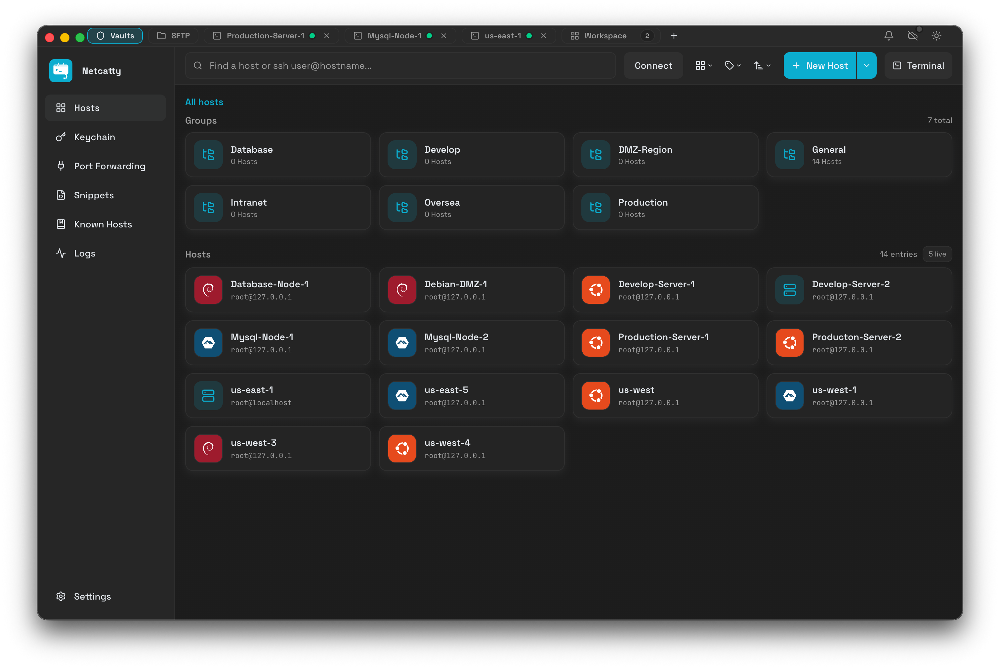

<p align="center">
  
</p>

<h1 align="center">Netcatty</h1>

<p align="center">
  <strong>モダンな SSH クライアント、SFTP ブラウザ & ターミナルマネージャー</strong>
</p>

<p align="center">
  Electron、React、xterm.js で構築された機能豊富な SSH ワークスペース。<br/>
  ホスト管理、分割ターミナル、SFTP、ポートフォワーディング、クラウド同期 — すべてが一つに。
</p>

<p align="center">
  <a href="https://github.com/user/netcatty/releases/latest"></a>
  &nbsp;
  <a href="#"></a>
  &nbsp;
  <a href="LICENSE"></a>
</p>

<p align="center">
  <a href="https://ko-fi.com/binaricat">
    
  </a>
</p>

<p align="center">
  <a href="./README.md">English</a> · <a href="./README.zh-CN.md">简体中文</a> · <a href="./README.ja-JP.md">日本語</a>
</p>

---

[](screenshots/main-window-dark.png)

---

# 目次 <!-- omit in toc -->

- [Netcatty とは](#netcatty-とは)
- [機能](#機能)
- [スクリーンショット](#スクリーンショット)
  - [ホスト管理](#ホスト管理)
  - [ターミナル](#ターミナル)
  - [SFTP](#sftp)
  - [キーチェーン](#キーチェーン)
  - [ポートフォワーディング](#ポートフォワーディング)
  - [クラウド同期](#クラウド同期)
  - [テーマとカスタマイズ](#テーマとカスタマイズ)
- [対応ディストリビューション](#対応ディストリビューション)
- [はじめに](#はじめに)
- [ビルドとパッケージ](#ビルドとパッケージ)
- [技術スタック](#技術スタック)
- [コントリビューション](#コントリビューション)
- [ライセンス](#ライセンス)

---

<a name="netcatty-とは"></a>
# Netcatty とは

**Netcatty** は、複数のリモートサーバーを効率的に管理する必要がある開発者、システム管理者、DevOps エンジニア向けに設計された、モダンなクロスプラットフォーム SSH クライアントおよびターミナルマネージャーです。

- **Netcatty は** PuTTY、Termius、SecureCRT、macOS Terminal.app の代替となる SSH 接続ツール
- **Netcatty は** デュアルペインファイルブラウザを備えた強力な SFTP クライアント
- **Netcatty は** 分割ペイン、タブ、セッション管理を備えたターミナルワークスペース
- **Netcatty は** シェルの代替ではありません — SSH/Telnet またはローカルターミナル経由でリモートシェルに接続します

---

<a name="機能"></a>
# 機能

### 🖥️ ターミナルとセッション
- **xterm.js ベースのターミナル**、GPU アクセラレーションレンダリング対応
- **分割ペイン** — 水平・垂直分割でマルチタスク
- **タブ管理** — ドラッグ＆ドロップで並べ替え可能な複数セッション
- **セッション永続化** — 再起動後もセッションを復元
- **ブロードキャストモード** — 一度の入力で複数のターミナルに送信

### 🔐 SSH クライアント
- **SSH2 プロトコル**、完全な認証サポート
- **パスワード＆キー認証**
- **SSH 証明書**サポート
- **ジャンプホスト / 踏み台サーバー** — 複数ホストを経由した接続
- **プロキシサポート** — HTTP CONNECT および SOCKS5 プロキシ
- **エージェント転送** — OpenSSH Agent および Pageant 対応
- **環境変数** — ホストごとにカスタム環境変数を設定

### 📁 SFTP
- **デュアルペインファイルブラウザ** — ローカル ↔ リモート または リモート ↔ リモート
- **ドラッグ＆ドロップ**ファイル転送
- **キュー管理**でバッチ転送
- **進捗追跡**、転送速度表示

### 🔑 キーチェーン
- **SSH キー生成** — RSA、ECDSA、ED25519
- **既存キーのインポート** — PEM、OpenSSH 形式
- **SSH 証明書**サポート
- **アイデンティティ管理** — 再利用可能なユーザー名＋認証方式の組み合わせ
- **公開鍵をエクスポート**してリモートホストへ

### 🔌 ポートフォワーディング
- **ローカルフォワーディング** — リモートサービスをローカルに公開
- **リモートフォワーディング** — ローカルサービスをリモートに公開
- **ダイナミックフォワーディング** — SOCKS5 プロキシ
- **ビジュアルトンネル管理**

### ☁️ クラウド同期
- **エンドツーエンド暗号化同期** — デバイスを離れる前にデータを暗号化
- **複数のプロバイダー** — GitHub Gist、S3 互換ストレージ、WebDAV、Google Drive、OneDrive
- **ホスト、キー、スニペット、設定を同期**

### 🎨 テーマとカスタマイズ
- **ライト＆ダークモード**
- **カスタムアクセントカラー**
- **50以上のターミナル配色**
- **フォントカスタマイズ** — JetBrains Mono、Fira Code など
- **多言語対応** — English、简体中文 など

---

<a name="スクリーンショット"></a>
# スクリーンショット

<a name="ホスト管理"></a>
## ホスト管理

Vault ビューはすべての SSH 接続を管理するコマンドセンターです。右クリックメニューで階層的なグループを作成し、グループ間でホストをドラッグ、パンくずナビゲーションでホストツリーを素早く移動できます。各ホストは接続状態、OS アイコン、クイック接続ボタンを表示。グリッドとリストビューを切り替え、強力な検索で名前、ホスト名、タグ、グループでフィルタリングできます。

| ダークモード | ライトモード | リストビュー |
|------------|------------|------------|
|  |  |  |

<a name="ターミナル"></a>
## ターミナル

WebGL アクセラレーション対応の xterm.js ベースのターミナルで、スムーズでレスポンシブな体験を提供。ワークスペースを水平または垂直に分割して、複数のセッションを同時に監視。ブロードキャストモードを有効にすると、すべてのターミナルに一度にコマンドを送信できます — フリート管理に最適。テーマカスタマイズパネルでは、50以上の配色スキームをライブプレビュー、フォントサイズの調整、JetBrains Mono や Fira Code を含む複数のフォントファミリーを選択できます。

| 分割ウィンドウ | テーマカスタマイズ |
|--------------|-----------------|
|  |  |


<a name="sftp"></a>
## SFTP

デュアルペイン SFTP ブラウザは、ローカルからリモート、リモートからリモートへのファイル転送をサポート。シングルクリックでディレクトリを移動、ペイン間でファイルをドラッグ＆ドロップ、転送進捗をリアルタイムで監視。インターフェースにはファイル権限、サイズ、変更日時を表示。複数の転送をキューに入れ、詳細な速度と進捗インジケーターで完了を確認。コンテキストメニューから名前変更、削除、ダウンロード、アップロード操作にすばやくアクセス。


<a name="キーチェーン"></a>
## キーチェーン

キーチェーンは SSH 認証情報を保管する安全な保管庫です。新しいキーを生成、既存のキーをインポート、エンタープライズ認証用の SSH 証明書を管理できます。

| キータイプ | アルゴリズム | 推奨用途 |
|----------|------------|---------|
| **ED25519** | EdDSA | モダン、高速、最も安全（推奨） |
| **ECDSA** | NIST P-256/384/521 | 高いセキュリティ、広くサポート |
| **RSA** | RSA 2048/4096 | レガシー互換性、ユニバーサルサポート |
| **証明書** | CA 署名 | エンタープライズ環境、短期認証 |

**機能：**
- 🔑 カスタマイズ可能なビット長でキーを生成
- 📥 PEM/OpenSSH 形式のキーをインポート
- 👤 再利用可能なアイデンティティを作成（ユーザー名＋認証方式）
- 📤 ワンクリックで公開鍵をリモートホストにエクスポート


<a name="ポートフォワーディング"></a>
## ポートフォワーディング

直感的なビジュアルインターフェースで SSH トンネルをセットアップ。各トンネルはリアルタイムステータスを表示し、アクティブ、接続中、エラー状態を明確に示します。トンネル設定を保存してセッション間で素早く再利用。

| タイプ | 方向 | ユースケース | 例 |
|-------|-----|------------|---|
| **ローカル** | リモート → ローカル | リモートサービスをローカルマシンでアクセス | リモート MySQL `3306` を `localhost:3306` に転送 |
| **リモート** | ローカル → リモート | ローカルサービスをリモートサーバーと共有 | ローカル開発サーバーをリモートマシンに公開 |
| **ダイナミック** | SOCKS5 プロキシ | SSH トンネル経由で安全にブラウジング | 暗号化された SSH 接続経由でインターネットをブラウズ |


<a name="クラウド同期"></a>
## クラウド同期

エンドツーエンド暗号化で、すべてのデバイス間でホスト、キー、スニペット、設定を同期。マスターパスワードがアップロード前にすべてのデータをローカルで暗号化 — クラウドプロバイダーは平文を見ることはありません。

| プロバイダー | 最適な用途 | セットアップ複雑度 |
|------------|----------|-----------------|
| **GitHub Gist** | クイックセットアップ、バージョン履歴 | ⭐ 簡単 |
| **Google Drive** | 個人利用、大容量ストレージ | ⭐ 簡単 |
| **OneDrive** | Microsoft エコシステムユーザー | ⭐ 簡単 |
| **S3 互換** | AWS、MinIO、Cloudflare R2、セルフホスト | ⭐⭐ 中程度 |
| **WebDAV** | Nextcloud、ownCloud、セルフホスト | ⭐⭐ 中程度 |

**同期対象：**
- ✅ ホストと接続設定
- ✅ SSH キーと証明書
- ✅ アイデンティティと認証情報
- ✅ スニペットとスクリプト
- ✅ カスタムグループとタグ
- ✅ ポートフォワーディングルール
- ✅ アプリケーション設定


<a name="テーマとカスタマイズ"></a>
## テーマとカスタマイズ

Netcatty を自分だけのものに。ライトモードとダークモードを切り替えたり、システム設定に従わせたり。好みに合わせてアクセントカラーを選択。アプリケーションは English や简体中文を含む複数の言語をサポートしており、コミュニティによる翻訳貢献を歓迎しています。クラウド同期を有効にすると、すべての設定がデバイス間で同期され、パーソナライズされた体験がどこでも利用できます。


---

<a name="対応ディストリビューション"></a>
# 対応ディストリビューション

Netcatty は接続したホストの OS アイコンを自動的に検出・表示します：

<p align="center">
  
  
  
  
  
  
  
  
  
  
  
  
</p>

---

<a name="はじめに"></a>
# はじめに

### ダウンロード

[GitHub Releases](https://github.com/user/netcatty/releases/latest) から最新版をダウンロードしてください。

> **⚠️ macOS ユーザーへ：** アプリはコード署名されていないため、macOS Gatekeeper によってブロックされます。ダウンロード後、以下のコマンドを実行して隔離属性を削除してください：
> ```bash
> xattr -cr /Applications/Netcatty.app
> ```
> または、アプリを右クリック → 開く → ダイアログで「開く」をクリックしてください。

### 前提条件
- Node.js 18+ と npm
- macOS、Windows 10+、または Linux

### 開発

```bash
# リポジトリをクローン
git clone https://github.com/user/netcatty.git
cd netcatty

# 依存関係をインストール
npm install

# 開発モードを起動（Vite + Electron）
npm run dev
```

### プロジェクト構造

```
├── App.tsx                 # メイン React アプリケーション
├── components/             # React コンポーネント
│   ├── Terminal.tsx        # ターミナルコンポーネント
│   ├── SftpView.tsx        # SFTP ブラウザ
│   ├── VaultView.tsx       # ホスト管理
│   ├── KeyManager.tsx      # SSH キー管理
│   └── ...
├── application/            # 状態管理 & 国際化
├── domain/                 # ドメインモデル & ロジック
├── infrastructure/         # サービス & アダプター
├── electron/               # Electron メインプロセス
│   ├── main.cjs            # メインエントリ
│   └── bridges/            # IPC ブリッジ
└── public/                 # 静的アセット & アイコン
```

---

<a name="ビルドとパッケージ"></a>
# ビルドとパッケージ

```bash
# 本番用ビルド
npm run build

# 現在のプラットフォーム用にパッケージ
npm run pack

# 特定のプラットフォーム用にパッケージ
npm run pack:mac     # macOS (DMG + ZIP)
npm run pack:win     # Windows (NSIS インストーラー)
npm run pack:linux   # Linux (AppImage, deb, rpm)
```

---

<a name="技術スタック"></a>
# 技術スタック

| カテゴリ | テクノロジー |
|--------|------------|
| フレームワーク | Electron 39 |
| フロントエンド | React 19, TypeScript |
| ビルドツール | Vite 7 |
| ターミナル | xterm.js 5 |
| スタイリング | Tailwind CSS 4 |
| SSH/SFTP | ssh2, ssh2-sftp-client |
| PTY | node-pty |
| アイコン | Lucide React |

---

<a name="コントリビューション"></a>
# コントリビューション

コントリビューションを歓迎します！お気軽に Pull Request を提出してください。

1. リポジトリをフォーク
2. フィーチャーブランチを作成 (`git checkout -b feature/amazing-feature`)
3. 変更をコミット (`git commit -m 'Add some amazing feature'`)
4. ブランチにプッシュ (`git push origin feature/amazing-feature`)
5. Pull Request をオープン

アーキテクチャの概要とコーディング規約については [agents.md](agents.md) を参照してください。

---

<a name="ライセンス"></a>
# ライセンス

このプロジェクトは **GPL-3.0 ライセンス** の下でライセンスされています - 詳細は [LICENSE](LICENSE) ファイルをご覧ください。

---

<p align="center">
  ❤️ を込めて作成 by <a href="https://ko-fi.com/binaricat">binaricat</a>
</p>
